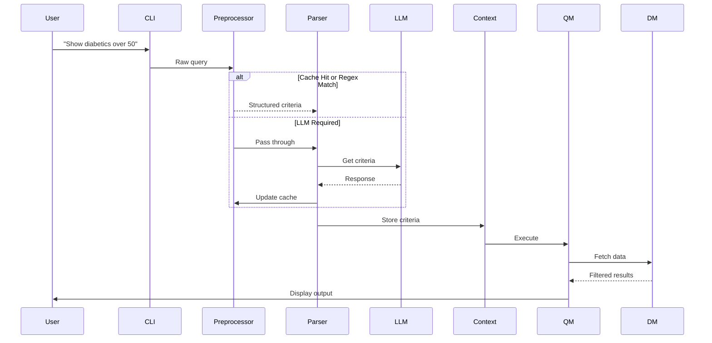

We are a team of two students and we are participating in a Datathlon competition. This competition has a very short time limit (few days).

The challenge is to develop a conversational agent that enables healthcare professionals to quickly and efficiently identify cohorts of patients with chronic diseases (diabetes, hypertension, COPD, etc.).

We have access to a pre-trained LLM (Claude 3 Sonnet via Amazon Bedrock) to build a conversational interface for healthcare professionals.
**Tools Provided**:
    - API key for a proxy server (`litellm.dedalus.com`) to access Claude 3 Sonnet.
    - Example code using the OpenAI client library (configured to route requests to Bedrock).
    - There are strong hints to use ChatLiteLLM library.

Here is a project structure summary so far:

## Project Structure

/root
│   .file
│   main.py
│   requirements.txt
│
├───core
│   │   context_manager.py
│   │   data_manager.py         # Renamed from data_loader.py
│   │   llm_handler.py
│   │   query_manager.py        # New
│   │   query_parser.py
│   │   query_preprocessor.py
│   │   results_analyzer.py     # New
│   │   visualizer.py           # Replaces viz_generator.py
│   │
│   └───__pycache__
│           context_manager.cpython-311.pyc
│           data_manager.cpython-311.pyc
│
├───data
│       alergias.csv
│       condiciones.csv
│       encuentros.csv
│       medicationes.csv
│       pacientes.csv
│       procedimientos.csv
│
├───interface
│       cli.py
│       webui.py                # Future web interface
│
├───tests
│   │   test_data_loader.py     # Should be renamed to test_data_manager.py
│   │   test_query_parser.py    # New (to be created)
│   │   __init__.py
│   │
│   └───__pycache__
│           test_data_loader.cpython-311.pyc
│           __init__.cpython-311.pyc
│
└───utils
    │   config.py
    │   logger.py
    │   validation.py
    │   __init__.py
    │
    └───__pycache__
            logger.cpython-311.pyc
            validation.cpython-311.pyc
            __init__.cpython-311.pyc

## **Pipeline Workflow**  

## **Core Modules**

### 1. Application Module (application.py)

#### Overview
The Application module serves as the service layer of the system, coordinating interactions between different components and implementing the main processing pipeline. It acts as an orchestrator that manages the flow of data and operations between various modules.

#### Core Responsibilities
- Coordinates the query processing pipeline
- Manages component lifecycle and interactions
- Provides high-level interface for the CLI and other potential interfaces
- Handles cross-cutting concerns across modules

#### Main Components
- Query Processing Pipeline
- Test Runner
- Component Management

#### Pipeline Flow
1. Receives user query from interface
2. Coordinates preprocessing via QueryPreprocessor
3. Manages parsing through Parser
4. Handles LLM interactions when needed
5. (Future) Will coordinate with Context and Query Manager

### 2. `data_manager.py`  
**Responsibility**: Centralized data storage and state management.  
**Methods**:  
- `load_data()` - Loads CSV files into pandas DataFrames with preprocessing.  
- `get_raw_data() -> dict` - Returns raw DataFrames (pacientes, condiciones, etc.).  
- `update_cohort(filtered_df: pd.DataFrame, filters: dict)` - Updates current filtered dataset.  
- `get_current_cohort() -> pd.DataFrame` - Returns active patient cohort.  
- `reset_filters()` - Restores raw datasets.  

---

### **3. `query_preprocessor.py`**  
**Responsibility**: Energy-efficient query handling through caching and regex parsing to minimize LLM calls.  
**Methods**:  
- `try_regex_parse(input: str) -> dict | None` - Attempts pattern matching using predefined medical regex rules  
- `check_cache(input: str) -> dict | None` - Searches cached queries with Levenshtein similarity matching  
- `update_cache(input: str, result: dict)` - Updates cache with LRU eviction policy  

---

### **4. `query_parser.py`**  
**Responsibility**: Convert natural language to structured criteria.  
**Methods**:  
- `parse_query(user_input: str) -> dict` - Main NLU method using LLM.  
- `parse_refinement(user_input: str, context: dict) -> dict` - Handles partial queries ("and above 25").  
- `validate_criteria(criteria: dict) -> bool` - Checks filter validity.  

---

### **5. `query_manager.py`**  
**Responsibility**: Execute filters and optimize queries.  
**Methods**:  
- `apply_filters(raw_data: dict, criteria: dict) -> pd.DataFrame` - Main filtering logic.  
- `_apply_temporal_filters(df: pd.DataFrame, date_ranges: dict)` - Date-based filtering.  
- `_apply_geographic_filters(df: pd.DataFrame, coords: tuple)` - Distance calculations (future).  

---

### **6. `context_manager.py`**  
**Responsibility**: Session state and iterative refinements.  
**Properties**:  
- `active_filters: dict` - Current filter criteria  
- `query_history: list` - Stack of previous queries  
**Methods**:  
- `merge_criteria(new_criteria: dict) -> dict` - Combines filters  
- `undo_last_action() -> dict` - Reverts to previous state  
- `get_session_context() -> dict` - Returns full context  

---

### **7. `llm_handler.py`**  
**Responsibility**: LLM interaction utilities.  
**Methods**:  
- `send_prompt(prompt: str) -> str` - Core LLM API call  
- `build_analysis_prompt(stats: dict) -> str` - Formats data for summary generation  
- `parse_json_response(response: str) -> dict` - Extracts structured data  

---

### **8. `results_analyzer.py`**  
**Responsibility**: Generate insights from filtered data and optimize payloads for LLM processing to reduce computational costs.  
**Methods**:  
- `summarize_for_llm(filtered_df: pd.DataFrame) -> str`  
  Generates a token-efficient text summary (counts, averages, frequencies) for LLM analysis.  
- `suggest_visualizations(stats: dict) -> list`  
  Recommends chart types based on cohort metrics (e.g., age distribution → histogram).  
- `prune_columns(df: pd.DataFrame) -> pd.DataFrame`  
  Removes non-essential columns (e.g., SNOMED codes) to minimize data size.  
- `calculate_metrics(df: pd.DataFrame) -> dict`  
  Computes key metrics: age distribution, condition prevalence, gender ratios.  
- `get_qualitative_sample(df: pd.DataFrame, sample_size=10) -> str`  
  Returns a markdown-formatted sample of patients for qualitative LLM analysis.  

---

### **9. `visualizer.py`**  
**Responsibility**: Data visualization generation.  
**Methods**:  
- `plot_age_distribution(df: pd.DataFrame) -> plotly.Figure`  
- `generate_heatmap(df: pd.DataFrame, columns: list) -> plotly.Figure`  
- `export_to_html(fig: plotly.Figure) -> str`  

---

## **Interface Modules**

### **1. `interface/cli.py`**  
**Responsibility**: Command-line interface handling.  
**Methods**:  
- `display_results(summary: str, fig: plotly.Figure)`  
- `get_user_input() -> str`  
- `show_filter_status(active_filters: dict)`  

---

## **Utility Modules**

### **1. `utils/logger.py`**  
**Responsibility**: Logging and error tracking.  
**Methods**:  
- `log_query(criteria: dict, result_count: int)`  
- `log_error(error_type: str, message: str)`  
- `get_logs() -> list`  

### **2. `utils/config.py`**  
**Properties**:  
- `LLM_TEMPERATURE = 0.3`  
- `MAX_TOKENS = 4096`  
- `DATA_PATH = "./data"`  

---

## Dataset Specifications
1. cohorte_pacientes.csv (Patients)
Column (ES) English Type    Description
PacienteID  PatientID   str Unique identifier
Genero  Gender  str Masculino/Femenino
Edad    Age int 19-84 years
Provincia   Province    str 6 Andalusian provinces
Latitud Latitude    float   Geographic coordinate
Longitud    Longitude   float   Geographic coordinate

2. cohorte_condiciones.csv (Conditions)
Column (ES) English Type    Description
PacienteID  PatientID   str Foreign key
Fecha_inicio    StartDate   date    Condition onset
Fecha_fin   EndDate date    Resolution date
Codigo_SNOMED   SNOMEDCode  str Clinical code
Descripcion Description str e.g., "Diabetes tipo 2"

3. cohorte_alergias.csv (Allergies)
Column (ES) English Type    Description
PacienteID  PatientID   str Foreign key
Fecha_diagnostico   DiagnosisDate   date    Allergy identification
Codigo_SNOMED   SNOMEDCode  str e.g., 91936005 (Pollen)
Descripcion Description str Allergy details

4. cohorte_medicationes.csv (Medications)
Column (ES) English Type    Description
PacienteID  PatientID   str Foreign key
Fecha de inicio StartDate   date    Prescription start
Fecha de fin    EndDate date    Prescription end
Código  ATC Code    str e.g., C09AA03
Nombre  Name    str Drug name
Dosis   Dose    str e.g., "10 mg"
Frecuencia  Frequency   str e.g., "Diario"
Vía de administración   Route   str Oral, IV, etc.

5. cohorte_encuentros.csv (Encounters)
Column (ES) English Type    Description
PacienteID  PatientID   str Foreign key
Tipo_encuentro  EncounterType   str Hospitalización/Urgencia/Atención Primaria
Fecha_inicio    StartDate   date    Encounter start
Fecha_fin   EndDate date    Encounter end

6. cohorte_procedimientos.csv (Procedures)
Column (ES) English Type    Description
PacienteID  PatientID   str Foreign key
Fecha_inicio    StartDate   date    Procedure start
Fecha_fin   EndDate date    Procedure end
Codigo_SNOMED   SNOMEDCode  str e.g., 303893007 (Brain MRI)
Descripcion Description str Procedure details